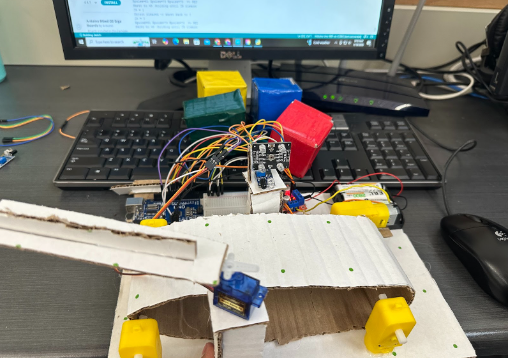
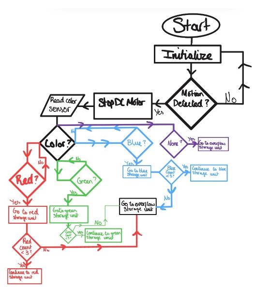

# Automated Recycling Conveyor Belt

## Overview
This project is an Arduino-based automated recycling conveyor belt designed to detect, classify, and sort colored objects into different bins. The system uses an infrared sensor to detect when an object is present, a color sensor to identify the object's color, a DC motor to drive the conveyor belt, and a servo motor to direct objects into the correct sorting bin. The goal of the project was to create an automated sorting system that combines sensors, motion control, and embedded programming.

---

## Project Photo

---

## Demo Video

Click the image below to watch the conveyor belt system sorting objects.

## Demo Video

[Watch the Conveyor Belt Demo](Automatic%20conveyor%20belt.mp4)

---

## Features
- Automatic object detection using an infrared sensor
- Color classification using a color sensor
- Conveyor belt driven by a DC motor
- Servo-controlled gate that directs objects into different bins
- Fully automated sorting process

---

## Hardware Components
- Arduino Uno  
- Flying Fish IR sensor  
- TCS3200 / TCS230 color sensor  
- L298N motor driver  
- DC motor  
- Servo motor  
- Breadboard  
- Jumper wires  
- Battery pack  
- Cardboard conveyor belt structure  

---

## How It Works
The conveyor belt runs continuously using a DC motor controlled by an L298N motor driver. When an object passes the infrared sensor, the system detects its presence and waits briefly so the object aligns with the color sensor. The color sensor then measures the red, green, and blue light intensity reflected from the object. The Arduino processes these values and determines the object's color classification. Based on the detected color, the servo motor rotates to a specific angle that directs the object into the correct sorting bin. The servo holds its position until the object clears the sensor, then returns to its starting position to prepare for the next item.

---

## Flowchart

The flowchart below shows the decision logic used by the system to detect and sort objects.

---

## Code

The Arduino code used for the conveyor belt system can be found here:

[View Project Code](conveyor-code.pdf)

---

## Development Process
Multiple sensors were tested before selecting the Flying Fish infrared sensor for reliable object detection. The color sensor was then integrated to classify objects by color, and a servo-controlled gate was implemented to route objects into different bins. The final system successfully combined object detection, color classification, and mechanical sorting into one automated process.

---

## Challenges
- Finding a reliable IR sensor for consistent object detection
- Adjusting sensor calibration and potentiometer settings
- Differentiating similar colors using the color sensor
- Building and aligning the physical conveyor belt structure
- Determining correct servo angles for accurate sorting

---

## Technical Specifications
- Microcontroller: Arduino Uno  
- Object Detection Sensor: Flying Fish IR sensor  
- Color Sensor: TCS3200 / TCS230  
- Motor Driver: L298N  
- Conveyor Drive: DC motor  
- Sorting Mechanism: Servo motor  
- Programming Language: Arduino C++  

---

## Future Improvements
- Improve conveyor belt structure and durability
- Add more precise color calibration
- Support additional object categories
- Improve sensor shielding to reduce false detections
- Replace cardboard prototype with stronger materials

